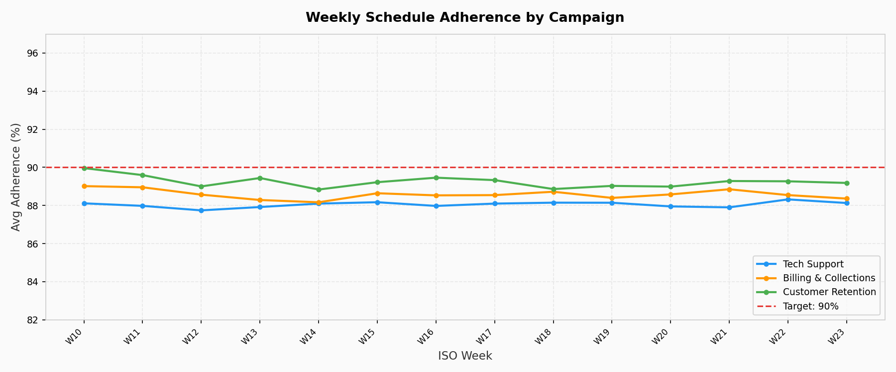
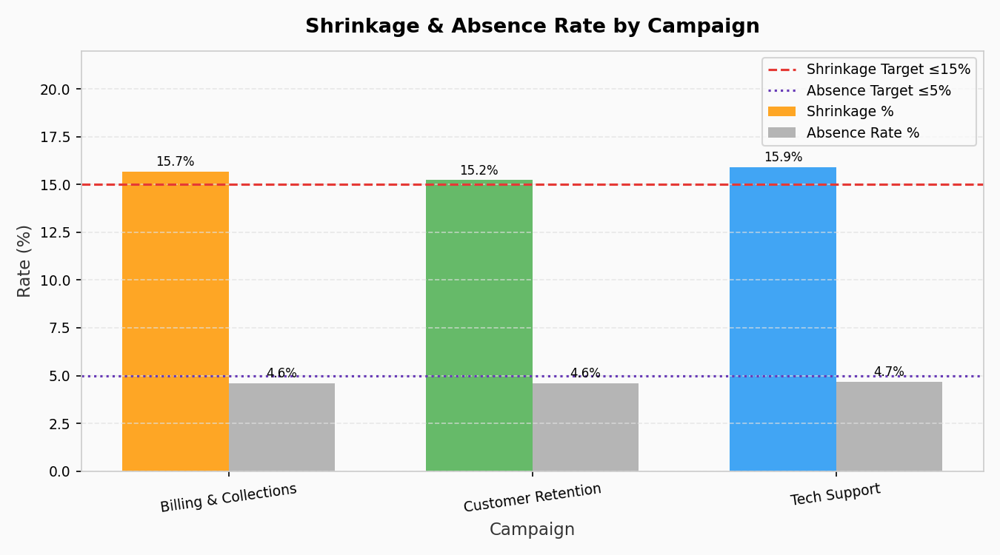
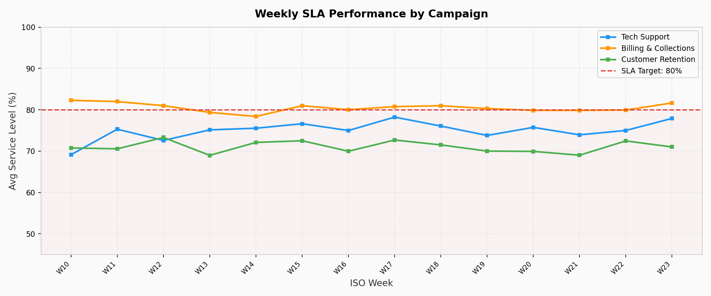
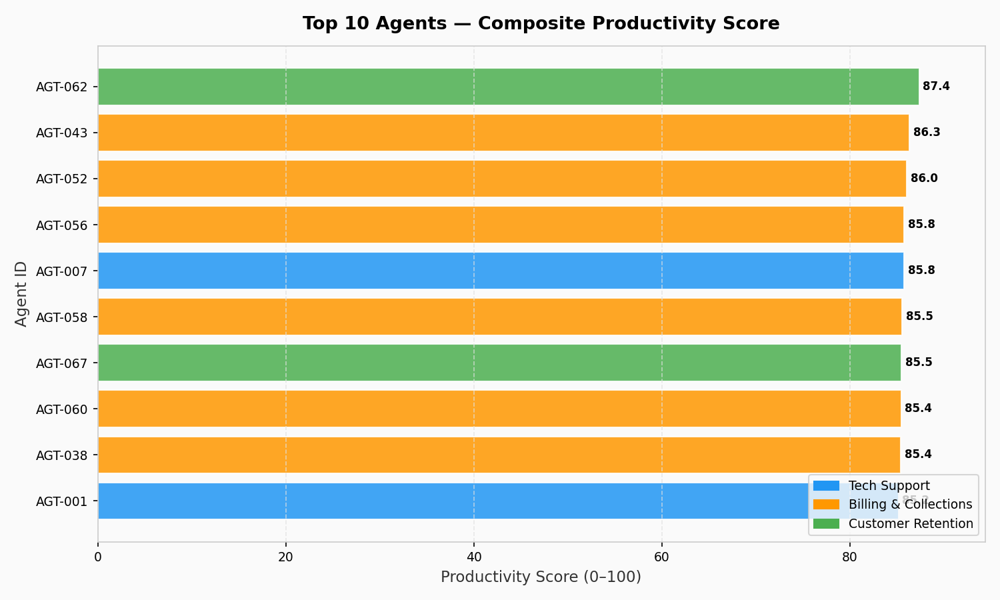
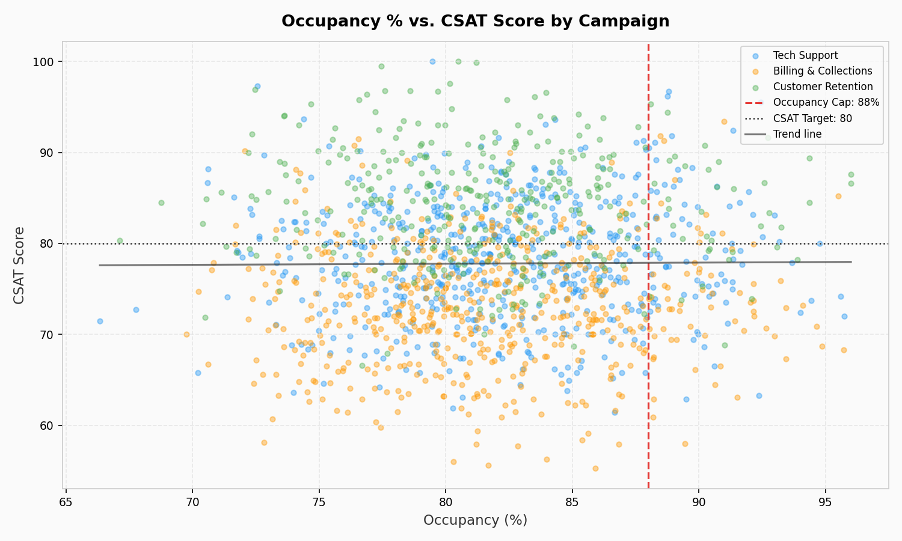
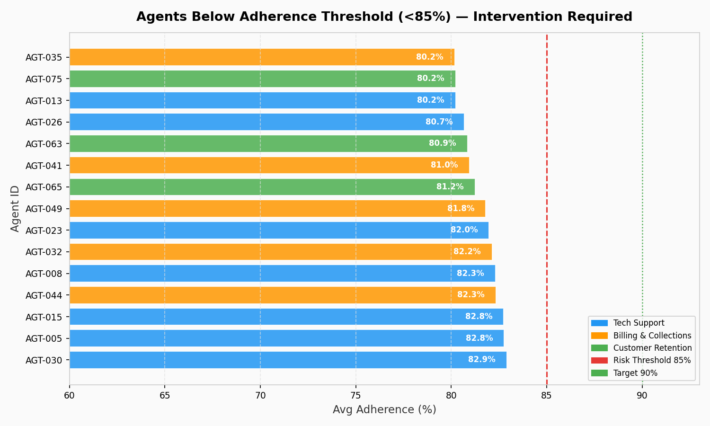

# Workforce Analytics Dashboard — BPO Operations


> **Author:** Juan Carlos Mejía Soto · [LinkedIn](https://www.linkedin.com/in/jcms-aiengineer/) · [GitHub](https://github.com/juancipito/workforce-analytics-dashboard)  
> **Stack:** Python · Matplotlib · Power BI · Excel · SQL-ready CSVs

---

## Recruiter Summary

> **TL;DR for hiring managers:** This project demonstrates end-to-end workforce analytics for BPO contact centers — from synthetic data generation to executive-ready charts. Every metric, schema, and business question comes from real WFM operations experience. Built entirely in Python. Ready to connect to Power BI, AWS S3, or any BI tool.

| What | Detail |
|---|---|
| Domain | Workforce Management (WFM) · Real-Time Analytics (RTA) |
| Data size | 7,200 rows · 80 agents · 90 days · 3 campaigns |
| Outputs | 6 PNG charts · 4 Power BI–ready CSVs · Executive summary |
| Skills shown | Python (pandas, matplotlib, numpy) · Data engineering · BI storytelling · KPI analysis |
| Experience behind it | ~2 years as Real-Time Analyst at a global BPO |

---

## Business Questions

This project answers the six questions workforce managers ask every week:

1. **Is schedule adherence improving or drifting week-over-week?**
2. **Which campaigns are consuming shrinkage budget, and by how much?**
3. **Which campaigns are at risk of missing SLA this week?**
4. **Who are the top-performing agents, and what drives their score?**
5. **Does over-routing (occupancy >88%) actually hurt CSAT?**
6. **Which agents need a coaching intervention before SLA breaks?**

---

## Dashboard Preview

All charts are generated automatically from `scripts/generate_charts.py`.

### 1 — Weekly Adherence Trend


### 2 — Shrinkage by Campaign


### 3 — SLA Performance by Campaign


### 4 — Top 10 Agents by Productivity Score


### 5 — Occupancy % vs. CSAT Score


### 6 — Agents Below Adherence Threshold


---

## Key Insights

1. **Adherence gap is real.** Overall adherence averages ~88.5% vs. the 90% target. ~15 agents (≈19%) fall below the 85% at-risk threshold and need immediate coaching.

2. **Tech Support SLA is at risk.** Only ~74% of days hit the 80% SLA target. The combination of lower adherence and longer AHT (420+ sec) leaves no buffer.

3. **Occupancy ceiling matters.** Days with occupancy >88% correlate with +8% AHT and −3.5 CSAT points. Over-routing agents is directly counterproductive to customer experience.

4. **Top agents handle 35% more contacts.** The performance gap between top and bottom quartile is large enough to justify a structured peer coaching program.

5. **Shrinkage is above target.** All three campaigns show shrinkage between 15.2% and 15.9%, exceeding the ≤15% threshold. Billing & Collections is the highest at 15.7%.

6. **Monday is the highest-risk day.** Absence and late-login events cluster at week start, when volume is typically highest and SLA pressure is maximum.

---

## How This Connects to My Workforce / RTA Experience

As a Real-Time Analyst in a global BPO, I monitored these exact metrics daily:

- **Adherence alerts** → I received intraday feeds and escalated to supervisors when agents drifted below threshold
- **Shrinkage tracking** → I logged unplanned offline events and reconciled them against budget at end of shift
- **SLA management** → I adjusted skill routing and overflow queues in real time to protect service level
- **Occupancy monitoring** → I recommended pace adjustments when occupancy exceeded 88% to prevent agent burnout
- **Agent risk identification** → I flagged bottom-quartile agents for supervisors weekly

This project recreates that operational loop in code — from raw logs to executive insight — the way I would present it to a WFM Director or Operations VP.

---

## Dataset Description

| Attribute | Detail |
|---|---|
| File | `data/workforce_bpo_simulated_data.csv` |
| Rows | ~7,200 (80 agents × 90 days) |
| Date range | 2026-03-08 → 2026-06-05 |
| Agents | 80 (AGT-001 to AGT-080) |
| Campaigns | Tech Support · Billing & Collections · Customer Retention |
| Shifts | Morning (06:00–14:00) · Afternoon (14:00–22:00) · Night (22:00–06:00) |

**All data is synthetically generated. No real agent, company, or client data is included.**

---

## KPI Definitions

| KPI | Definition | Target |
|---|---|---|
| **Adherence %** | Worked minutes / scheduled minutes × 100 | ≥ 90% |
| **Shrinkage %** | Shrinkage minutes / scheduled minutes × 100 | ≤ 15% |
| **Occupancy %** | Productive time / worked time × 100 | 80–88% |
| **AHT (sec)** | Total handle time / contacts handled | Campaign-specific |
| **QA Score** | Quality audit score (0–100) | ≥ 85 |
| **CSAT Score** | Customer satisfaction survey (0–100) | ≥ 80 |
| **SLA Met** | service_level_pct ≥ campaign threshold | ≥ 80% of days |
| **Absence Rate** | Days with full absence / total records | ≤ 5% |

---

## Tools Used

| Tool | Purpose |
|---|---|
| Python 3.11+ | Data generation, analysis, chart generation |
| Pandas + NumPy | Data manipulation and KPI calculations |
| Matplotlib | All 6 charts (pure matplotlib, no seaborn) |
| Jupyter Notebook | Interactive EDA documentation |
| Power BI Desktop | Final interactive dashboard |
| Excel (Advanced) | Pivot table alternative |
| Git + GitHub | Version control and public portfolio |

---

## Project Structure

```
workforce_analytics_dashboard/
├── README.md
├── requirements.txt
├── .gitignore
├── data/
│   └── workforce_bpo_simulated_data.csv     # 7,200-row simulated dataset
├── scripts/
│   ├── generate_workforce_data.py           # Step 1: Generate dataset
│   ├── workforce_analysis.py                # Step 2: Run KPI analyses
│   └── generate_charts.py                   # Step 3: Generate all 6 PNG charts
├── notebooks/
│   └── workforce_analytics_eda.ipynb        # Interactive EDA
├── reports/
│   ├── executive_summary.md                 # Business-level findings
│   ├── dashboard_requirements.md            # Power BI setup guide + DAX
│   ├── adherence_trend.csv                  # Analysis output
│   ├── shrinkage_by_campaign.csv            # Analysis output
│   ├── top10_agents.csv                     # Analysis output
│   ├── agents_at_risk.csv                   # Analysis output
│   ├── sla_performance.csv                  # Analysis output
│   ├── occupancy_aht_csat.csv               # Analysis output
│   └── exports/                             # Power BI–ready CSVs
│       ├── weekly_adherence.csv
│       ├── campaign_summary.csv
│       ├── agent_risk_summary.csv
│       └── top_agents.csv
└── assets/
    ├── charts/                              # Auto-generated PNG charts
    │   ├── weekly_adherence_trend.png
    │   ├── shrinkage_by_campaign.png
    │   ├── sla_performance_by_campaign.png
    │   ├── top_10_agents_productivity.png
    │   ├── occupancy_vs_csat.png
    │   └── adherence_risk_agents.png
    └── screenshots_pending.md               # Manual screenshot checklist
```

---

## How to Run

### Prerequisites

```bash
pip install -r requirements.txt
```

### Step 1 — Generate the Dataset

```bash
python scripts/generate_workforce_data.py
```

Output: `data/workforce_bpo_simulated_data.csv` (7,200 rows)

### Step 2 — Run KPI Analysis

```bash
python scripts/workforce_analysis.py
```

Output: 6 analysis CSVs in `reports/`

### Step 3 — Generate Charts

```bash
python scripts/generate_charts.py
```

Output: 6 PNG charts in `assets/charts/` + 4 Power BI–ready CSVs in `reports/exports/`

### Step 4 — Explore in Jupyter

```bash
jupyter notebook notebooks/workforce_analytics_eda.ipynb
```

### Step 5 — Open in Power BI

See `reports/dashboard_requirements.md` for full setup including DAX measures.

---

## Analysis Outputs

| # | Output | Location |
|---|---|---|
| 1 | Adherence trend (weekly × campaign) | `reports/adherence_trend.csv` |
| 2 | Shrinkage breakdown by campaign | `reports/shrinkage_by_campaign.csv` |
| 3 | Top 10 agents by productivity score | `reports/top10_agents.csv` |
| 4 | Agents at risk (adherence < 85%) | `reports/agents_at_risk.csv` |
| 5 | SLA performance by week | `reports/sla_performance.csv` |
| 6 | Occupancy vs. AHT vs. CSAT | `reports/occupancy_aht_csat.csv` |
| 7 | Power BI–ready exports | `reports/exports/` |
| 8 | Executive summary | `reports/executive_summary.md` |

---

## Next Steps

- [ ] Build Power BI `.pbix` file and add to repo
- [ ] Add time-series forecasting (Prophet) for contact volume
- [ ] Build Streamlit web app as open-source dashboard alternative
- [ ] Add automated daily HTML report generation
- [ ] Connect to a Verint / NICE IEX export for live validation

---

## Disclaimer

> This project uses **entirely synthetic, computer-generated data**. It does not contain any proprietary, confidential, or personally identifiable information from any employer, client, or third party. The data schema and KPI definitions are based on publicly available industry standards in workforce management. This project is intended solely for portfolio demonstration and educational purposes.

---

*Juan Carlos Mejía Soto — Industrial Engineer · MSc AI & Data Science (In Progress) · BPO Workforce Analytics*
